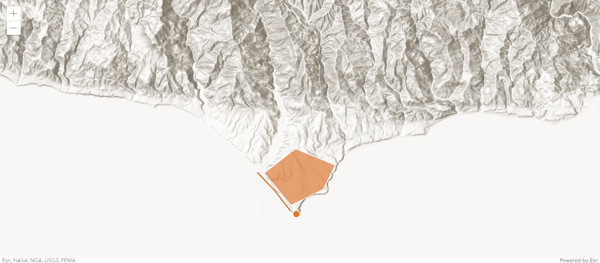
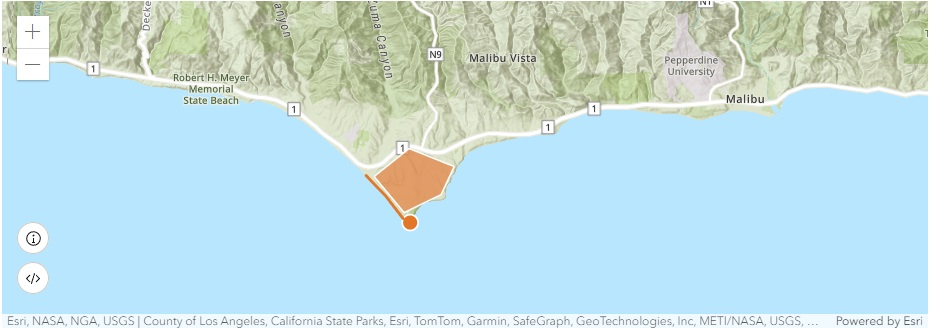
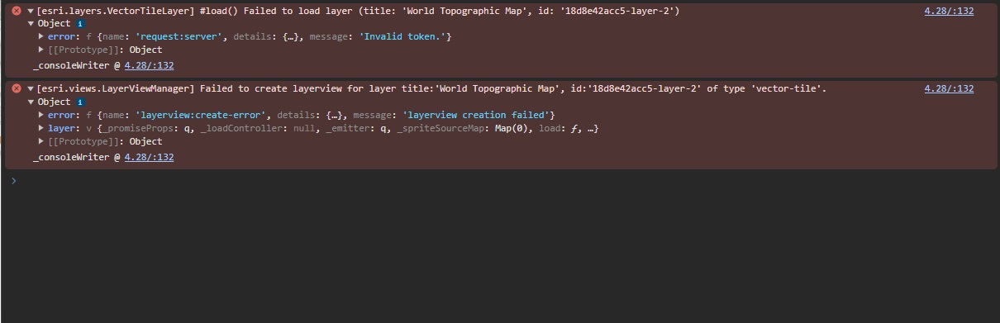

# 1st Bug Report

#Tutorials: Display a map 2D and Add a point, line, and polygon
The main bug I ran into was displaying the topographic base layer on my map.

What my map current looks like:

What my map should have looked like based on the tutorial and their provided images (image taken from the 'Add a point, line, and polygon tutorial):

## Method to reproduce:
Follow these tutorials:
- https://developers.arcgis.com/javascript/latest/tutorials/display-a-map/
- https://developers.arcgis.com/javascript/latest/tutorials/add-a-point-line-and-polygon/

I inserted the code directly into github in a new document and pushed it from my browser directly.

## Attempt to debug:
I was informed by other students that the tutorial from 'Display a map 2D' included and error that could be fixed from code beneath the API Key on ArcGIS Developers.

Taken from ArcGIS Developers:
esriConfig.apiKey = "<YOUR_API_KEY>";
      const map = new Map({
        basemap: "arcgis-topographic" // Basemap layer
      });

Vs. What the tutorial instructed us to do:
esriConfig.apiKey = "<YOUR_API_KEY>";
      const map = new Map({
        basemap: "arcgis/topographic" // Basemap layer
      });

I waited 10 minutes after pushing the edit to Github however I still ended with with the following errors in my source code:

